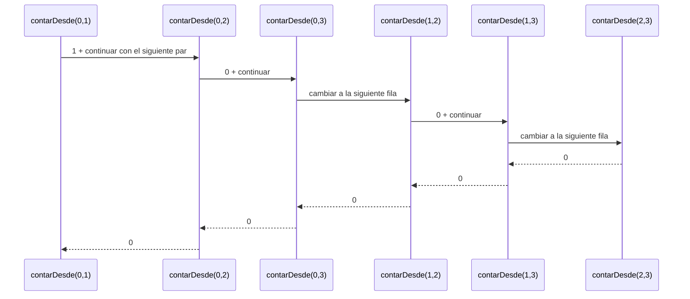
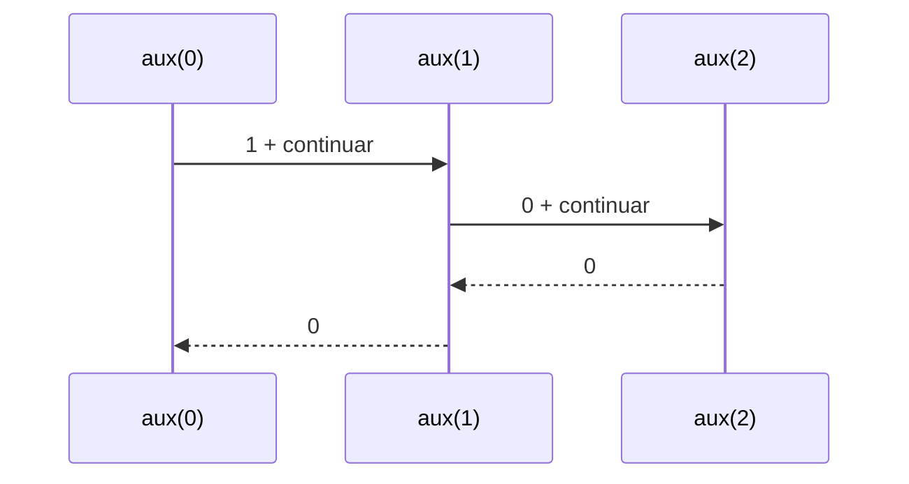
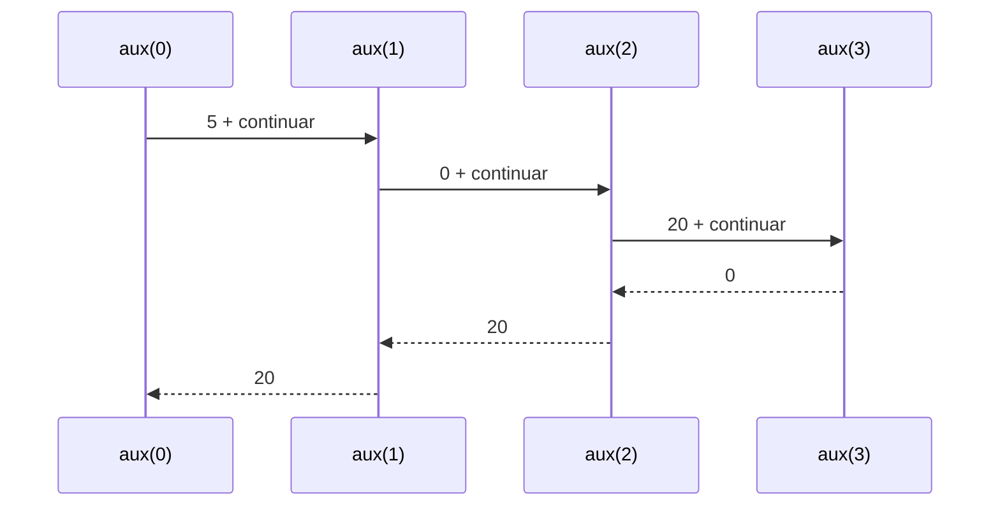
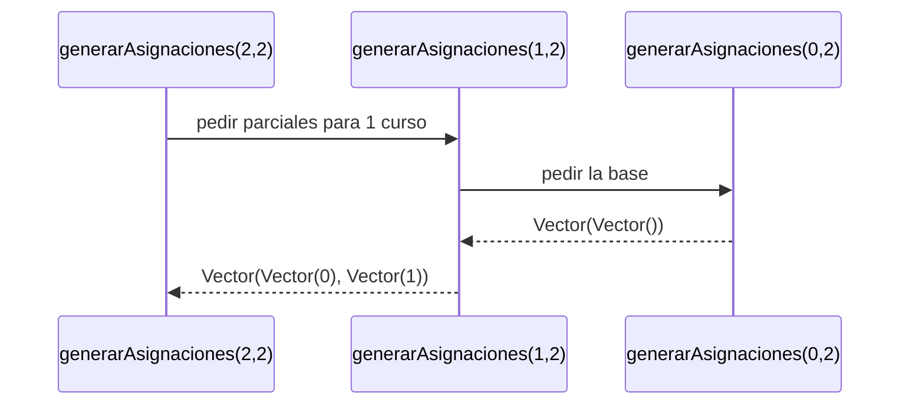

# Informe de procesos

## Integrantes del grupo

| Nombre completo            | Codigo   | Correo electronico                    |
|----------------------------|----------|---------------------------------------|
| Kevin Alejandro Marulanda  | 2380697  | Kevin.marulanda@correounivalle.edu.co |

## Informe de procesos

Este apartado documenta el comportamiento de las funciones recursivas de la
solucion secuencial. El requisito del enunciado es mostrar ejemplos pequenos,
explicar el proceso que sigue el programa y representar la pila de llamadas con
Mermaid. Para mantener la lectura clara, se usan instancias reducidas y se
explica solo la recursion que aparece en `AsignacionAulas.scala`.

Las funciones que se analizan aqui son:

- `choques(cursos, a)`
- `capacidadFallida(cursos, aulas, a)`
- `desperdicio(cursos, aulas, a)`
- `generarAsignaciones(n, m)`

Las funciones `movilidad` y `asignacionOptima` no se incluyen en este punto
porque, en la version final del proyecto, se implementan sin recursion
explicita.

### Vista general

| Funcion | Caso base | Paso recursivo |
|---------|-----------|----------------|
| `choques` | `i >= cursos.length - 1` | avanza sobre `(i, j)` y luego cambia de fila |
| `capacidadFallida` | `i >= cursos.length` | evalua el curso `i` y llama a `aux(i + 1)` |
| `desperdicio` | `i >= cursos.length` | evalua la contribucion del curso `i` y llama a `aux(i + 1)` |
| `generarAsignaciones` | `n == 0` | toma las asignaciones parciales y las extiende con cada aula |

### 1. `choques(cursos, a)`

La recursion real vive en el auxiliar `contarDesde(i, j)`. La funcion recorre
todos los pares `(i, j)` con `i < j`, cuenta `1` solo cuando dos cursos se
solapan y ademas comparten aula, y acumula el resto del conteo al volver de la
llamada recursiva.

Ejemplo pequeno:

- Cursos: `C1`, `C2`, `C3`
- Asignacion: `a = [0, 0, 1]`
- Solo `C1` y `C2` chocan: el resultado esperado es `1`

Lectura del proceso:

- `contarDesde(0,1)` detecta el choque entre `C1` y `C2`.
- El resto de llamadas no suma choques adicionales.
- El valor final es `1`.

### 2. `capacidadFallida(cursos, aulas, a)`

El auxiliar `aux(i)` revisa un curso por vez. Si el aula asignada no alcanza
para la cantidad de estudiantes, suma `1`; si no, suma `0`. Luego avanza con
`aux(i + 1)` hasta llegar al caso base.

Ejemplo pequeno:

- Cursos:
  - `C1 = ("M01", 4, 8, 35)`
  - `C2 = ("M02", 6, 10, 20)`
- Aulas:
  - `E101 = 30`
- Asignacion: `a = [0, 0]`

En este caso, `C1` falla por capacidad y `C2` si cabe. El resultado es `1`.

Lectura del proceso:

- `aux(0)` detecta que `35 > 30`, por eso suma `1`.
- `aux(1)` detecta que `20 <= 30`, por eso suma `0`.
- `aux(2)` es el caso base y retorna `0`.
- El total queda en `1`.

### 3. `desperdicio(cursos, aulas, a)`

La recursion tambien usa un auxiliar `aux(i)`. En este caso la contribucion del
curso es la diferencia `capAula(aulaAsignada) - estCurso(curso)` solo cuando el
aula asignada tiene capacidad suficiente. Si no, la contribucion es `0`.

Ejemplo pequeno:

- Cursos: `c1 = [25, 30, 20]`
- Aulas: `a1 = [30, 40]`
- Asignacion: `a = [0, 0, 1]`

La contribucion total es:

- Curso 1: `30 - 25 = 5`
- Curso 2: `30 - 30 = 0`
- Curso 3: `40 - 20 = 20`

Resultado esperado: `25`.

Lectura del proceso:

- `aux(0)` aporta `5`.
- `aux(1)` aporta `0`.
- `aux(2)` aporta `20`.
- `aux(3)` es el caso base.
- El desperdicio total queda en `25`.

### 4. `generarAsignaciones(n, m)`

Esta funcion genera todas las asignaciones posibles de `n` cursos en `m`
aulas. La recursion reduce `n` hasta llegar a `0`, donde devuelve la unica
asignacion vacia. Luego, al deshacer la recursion, extiende cada asignacion
parcial con cada aula posible.

Ejemplo pequeno:

- `generarAsignaciones(2, 2)`
- Resultado esperado:
  `Vector(Vector(0,0), Vector(0,1), Vector(1,0), Vector(1,1))`

Lectura del proceso:

- El caso base `n == 0` devuelve `Vector(Vector())`.
- Con `n == 1`, cada aula extiende la unica asignacion vacia y produce dos
  asignaciones.
- Con `n == 2`, cada asignacion parcial vuelve a extenderse con cada aula y el
  resultado final tiene `m^n = 2^2 = 4` asignaciones.

## Cierre

La idea comun en todas estas funciones es la misma: cada llamada consume una
parte pequena del problema, avanza hacia un caso base y luego reconstruye la
respuesta al volver de la recursion. Ese comportamiento es el que se espera
que el evaluador pueda seguir en la pila de llamadas y en los ejemplos
pequenos mostrados en este informe.
